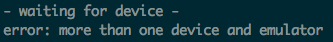

# ADB Extended
A simple CLI that builds upon the existing
Android Debug Bridge (ADB) to provide better support
when dealing with running adb commands on multiple devices.

For example, running an 'adb logcat' with multiple devices
connected would result in an error message like this :

Now, if you run with adbe you get this:

Giving the option to run this command on individual
devices or on all of them.

## Installing

* Clone the project.
* rename to adbe if you like, and add to the path
* run at least once as root so the .jar can be generated and speed up a LOT the. next builds.

## Requirements
* scala and adb both on PATH.
