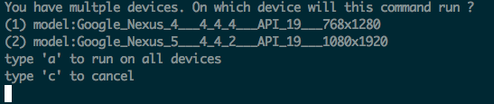

# ADB Extended
A simple CLI that builds upon the existing
Android Debug Bridge (ADB) to provide better support
when dealing with running adb commands on multiple devices.

For example, running an 'adb logcat' with multiple devices
connected would result in an error message like this :

Now, if you run with adbe you get this:

Giving the option to run this command on individual
devices or on all of them.

## Installing

Clone the project, copy adbe.scala to /urs/local/bin
an run as a normal script

## Requirements
* scala and adb both on PATH
